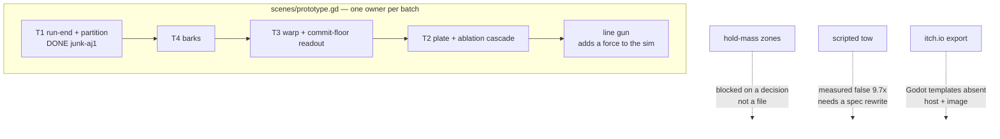
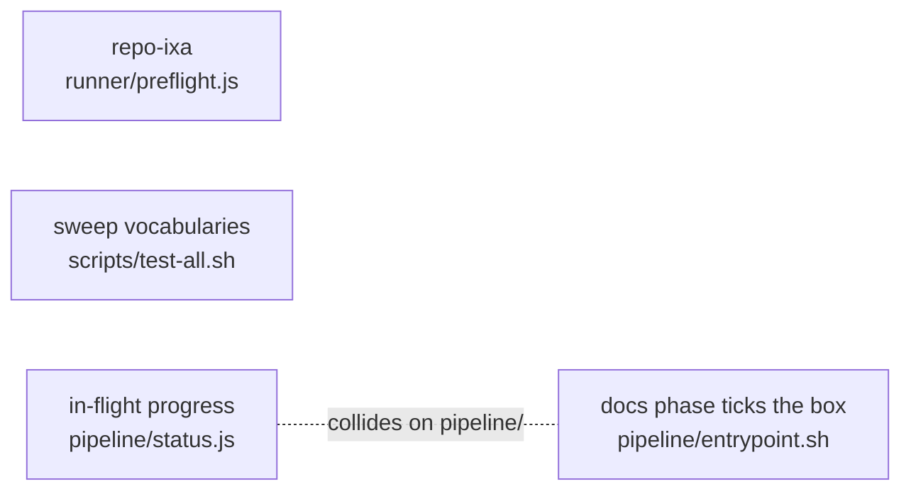

# What can actually run in parallel (2026-07-31)

The `concurrency` knob shipped (change-log rows `repo-teq`, `repo-i9y`). This is the map of where
it buys anything, drawn from real remaining work rather than from hypotheticals.

**The short answer: file ownership decides everything, and it is not evenly distributed.** One
target's whole remaining backlog funnels through a single file and cannot be parallelised at all;
the other has three independent lanes. The knob is worth turning up on one and pointless on the
other, and nothing in the runner can tell them apart — a planning session has to.

## The rule the graph is drawn from

Every task in one batch forks from the same integration branch, so **two tasks that write one file
produce conflicting pull requests.** That is not a runner limitation and no scheduler fixes it: it
is what "fork from the same commit" means. Concurrency multiplies throughput only across tasks
whose *write sets* are disjoint.

## Target project: everything is one lane

**Five sequential tasks, one lane.** T2, T3, T4 and the line gun all write `scenes/prototype.gd`,
so `concurrency: 2` on that project would start two workers, have them both fork the same commit,
and produce two pull requests that cannot both merge. **Turning the knob up there is worse than
useless** — it converts a queue into a merge conflict.

The three dotted items are not blocked on a file at all. They are blocked on a decision, a spec
rewrite and a host prerequisite respectively, so no amount of concurrency reaches them.

## This repo: three independent lanes

`runner/`, `scripts/` and `pipeline/` are separately-built components and the work parked against
them is genuinely disjoint. **A and B are the honest first test of the pool**: two tasks, two
components, no shared write outside documentation.

## The collision that survives every partition

**Every task's documentation phase writes `DESIGN.md`, `docs/STATUS.md` and `CLAUDE.md`.** That was
measured across four batches before the knob existed and it held every time. Concurrency does not
cause it and file-ownership planning cannot prevent it, because the docs phase is where a task
explains itself.

It resolves mechanically — both sides are additive, keep both — and §12's change-log rows carry
their own slugs so rows never collide. But it means **a parallel batch always lands N pull requests
that conflict in prose**, and someone has to resolve them. That cost is linear in batch width and
is the real price of the knob.

## What to expect from a two-wide run, stated before running it

- **Elapsed time is bounded by the slowest task, not the sum.** Two tasks of 20 and 50 minutes take
  50, not 70. A batch of similar-length tasks gains most; one long task among short ones gains
  almost nothing.
- **It does not multiply subscription capacity.** Two containers exhaust the same usage window twice
  as fast and then both park. Concurrency buys elapsed time, never throughput, and `repo-i9y`'s
  run-level park is what stops N workers each waiting out their own window.
- **The Beads writes stay serialised.** `runner/bd.js` is synchronous by construction — a constraint
  `repo-sls` deliberately preserved — so the sole-writer rule survives the pool.
