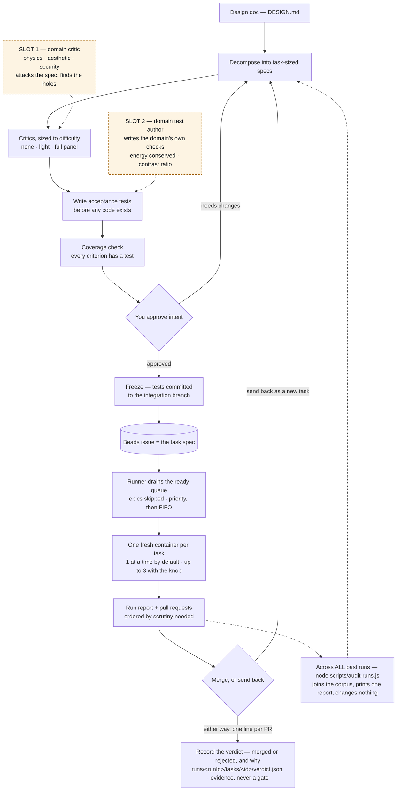
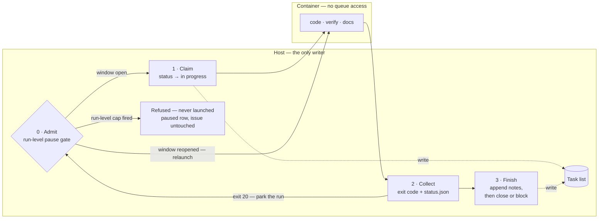
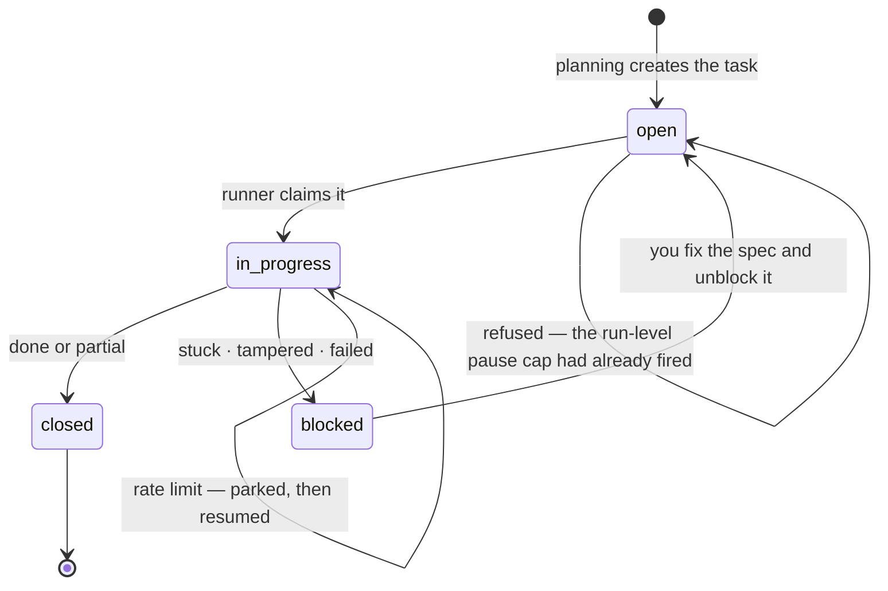
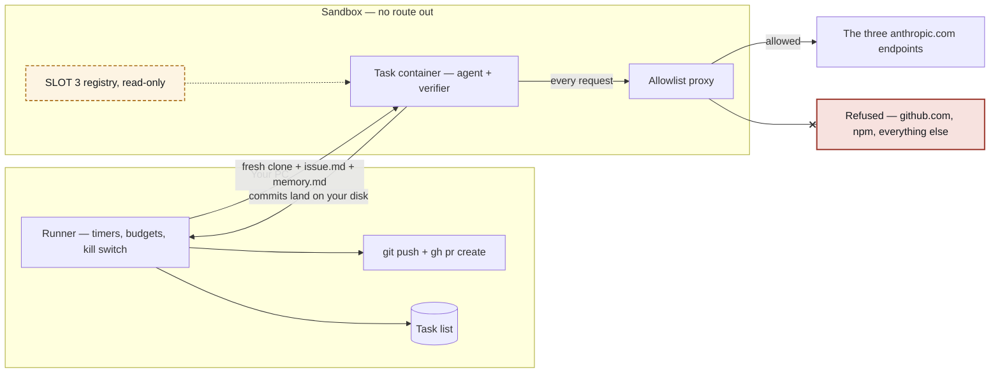

# How the pipeline works — diagrams

Visual companion to `DESIGN.md`. The doc is authoritative; these are views of it.

**Dashed amber nodes are the domain-specialist slots from §3.5.** Two of them work today
with no code (they are planning-session moves); the third needs a build. Nothing dashed
is a gate — a specialist can never fail a task.

## End to end

Planning is interactive, implementation is autonomous, review is interactive. The
Beads queue is the join between them.

The dotted branch off the run report is the only reader that spans runs (§5, change-log
row `repo-73k`). It is post-hoc and host-only: nothing in a run waits on it, it gates
nothing, and what it finds reaches the pipeline the same way any other observation does —
through a human, into a planning session.

Slots 1 and 2 need **no pipeline code**: they are prompts you run during a planning
session, before anything is frozen. Slot 2 is the higher-leverage of the two — a domain
check that becomes a frozen test steers the retry loop on every attempt, whereas a
review only complains once.

The verdict node is `node scripts/verdict.js record <issue-id> <merged|rejected> "<why>"`
(§5, change-log row `repo-1ie`) — deterministic scaffolding that writes down the one
signal the pipeline cannot generate about itself. It hangs off the decision rather than
sitting in the path back to planning, because it records *either* outcome and gates
neither: no arrow leaves it.

## Inside one task container

The sequence is scaffolding, not an LLM decision. The verifier is the only authority;
the agent never judges its own work.

**Each of the three boundaries above also writes itself down.** On *entry* to the code,
verify and docs phases the entrypoint sets `status.json`'s `phase` — `code` / `verify` /
`docs`, the only values there are — through `pipeline/status.js`, which stays the sole
writer of that file (change-log row `repo-bmd`). It is the live feed §5's dashboard reads
to tell a task that is working from one that is being judged; the write is non-fatal and
nothing in the diagram branches on it, so the arrows are unchanged by it.

Slot 3 is the one that needs building, and the sockets are already in place: the
`advisories` array exists in `status.schema.json` (typed, and documented as evidence
that can never change the exit code), advisor definitions would ride in the existing
read-only `/pipeline` mount, and `pipeline.config.json` already is the per-project
selection file. What is missing is the loop itself plus rendering in the report and PR.

**Why it sits after the verifier, not before:** an LLM judge cannot be frozen, so making
one a gate would void the three-attempt cap and produce unactionable 2 AM failures. By
the time an advisor runs, the task has already passed or failed on deterministic
grounds; the advisor only annotates.

## How a task moves through the queue

Nothing is ever deleted. A task is claimed, then closed or blocked, and every run
appends to its notes — so a stuck task arrives in review carrying its own history.

**The host is the only writer.** The container has no queue access at all: it reports
outcomes purely through its exit code and `status.json`. If the container wrote to the
queue, those writes would land on a task branch that might never merge, and the work
queue would fork along with the code.

Step 0 is the **run-level rate-limit park** (§4.7, §7 — change-log row `repo-i9y`): one
gate for the whole run, built once and shared by every task in flight. The first exit 20
opens one shared wait on that task's reported reset time; later reporters join it and never
extend it. Park means **admit no new work**, never kill what is running — a live container
whose window is genuinely closed exits 20 by itself and joins the same wait. It sits
*before* the claim on purpose: when the run-level cycle cap has fired, the task never
launches and the queue is never touched, so its issue stays `open` for the next run rather
than stranded `in_progress`. It still gets a `paused` row in the manifest, because a task
missing from `run.json` after an unattended overnight run is a hole in the record.

The claim in step 1 is what stops a task being picked twice, and it is why a crashed run
leaves issues stranded `in progress` — the next run's preflight sweeps those back to
`open`. The claim only holds while there is one writer, so preflight's **first** gate is a
lock on the target repo: a second run against the same project is refused by name before
it can read the queue, and a lock whose owning process is gone is taken over (change-log
row `repo-os9`).

The same drawing holds at `concurrency` > 1: **one** runner process holds up to N task
containers of its project at once (default 1, ceiling 3 — change-log row `repo-teq`), and the
host box is still the single writer. Never N runner processes against one queue — the claim
in step 1 and the lock above it both assume one. Tasks in flight together share this diagram;
the runner hands their results back in ready-queue order, so the manifest reads the same at
any depth.

Every arrow into the task list is a bounded, synchronous `bd` call — `bdTimeoutMs` in the
run config, default 60s, applied by `runner/bd.js` to every spawn it makes (change-log row
`repo-sls`). Step 3 is the reason: it runs *after* the container exits, so a `bd` that hangs
there would leave finished work claimed and its outcome unwritten, with no timer anywhere to
end the wait. A call that exceeds the bound is killed and reported as an ordinary failure,
which the steps above already know how to handle.

`blocked` is doing quiet but critical work: it removes failed work from the ready queue.
Without it a task that cannot pass would be picked up again on every run, forever.

The `open → open` self-loop is the run-level park's refused population: the gate is
consulted before the claim, so a task the fired cap turns away never enters the diagram's
`in_progress` half at all and the next run picks it up untouched.

An **epic** never enters this diagram at all. `bd ready` returns it alongside its children
and never closes it when they close, so the runner filters ready entries typed `epic` out
before the loop and names them in its queue-summary line — skipped, but never silently
(§3.1, §4.12).

## Where the walls are

The container holds exactly one credential and cannot reach a git host. Everything
durable — the queue, the credentials, the push — lives on the host.

Arrow styles carry meaning: a solid arrow is an allowed path, **an ✕ arrowhead is a
refusal**, and a dotted arrow is a permitted but read-only path. (These were previously
both dotted, which made a wall look like a doorway.)

The sandbox is **per project**. The network and the proxy take their names from the run
config — derived from the project segment of `run.config.<project>.json` when it names
neither — so two runner processes against two projects draw two copies of this diagram
side by side, and neither one's `up` or `down` touches the other's plumbing (change-log
row `repo-jur`). The proxy *image* is shared; only the running container and the network
are per project.

A specialist that needs a different model or a different tool changes nothing structural:
the coding agent is already swappable through `agentCommand` → `PIPELINE_AGENT_CMD`, and
the contract is only "a shell command that reads a prompt on stdin and edits files." A
non-Anthropic tool would additionally need its domain added to the allowlist — the one
place the closed-network policy would have to be revisited deliberately.

## What each outcome does

| Outcome | Exit | Report status | Beads | Branch pushed | PR |
|---|---|---|---|---|---|
| Acceptance pass, regressions pass or absent | 0 | done | closed | yes | yes |
| Acceptance pass, regressions fail | 0 | partial | closed | yes | yes, flagged |
| Bailed after 3 attempts | 10 | stuck | blocked | yes, WIP | no |
| Frozen tests modified | 11 | tampered | blocked | yes, WIP | no |
| Usage limit hit | 20 | paused | stays in progress | not yet | not yet |
| Internal error | 30 | failed | blocked | if commits exist | no |
| Wall-clock kill | — | failed | blocked | if commits exist | no |

The table is unchanged by the run-level park, deliberately — parking is *scheduling*, never
*judgment*. A task the fired pause cap refused adds no outcome: it reports the existing
`paused` status, and the only difference from the row above is that it never launched, so
Beads is untouched and its issue stays `open` rather than in progress (§4.7).

`blocked` is what takes failed work out of the ready queue: it needs a human decision
in review, so the loop can never re-pick it. **No advisor verdict appears in this table** —
that is the point. Advisory notes ride along in the PR body and the run report as
evidence for you, and change none of these outcomes.
