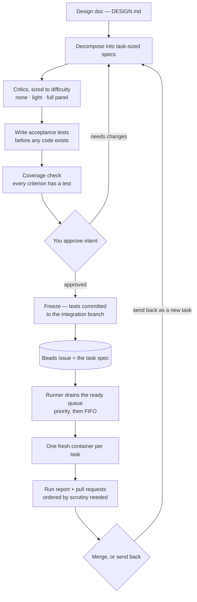
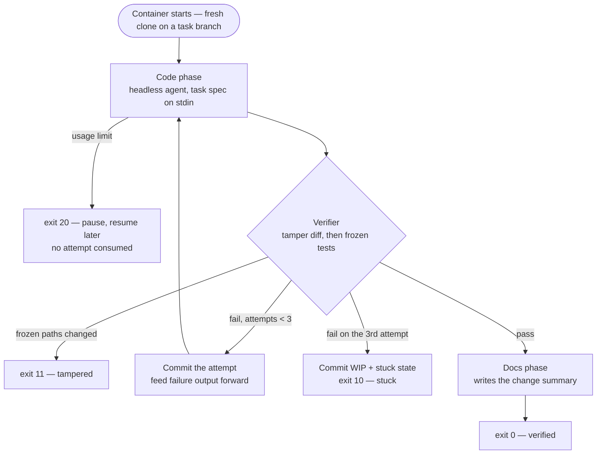
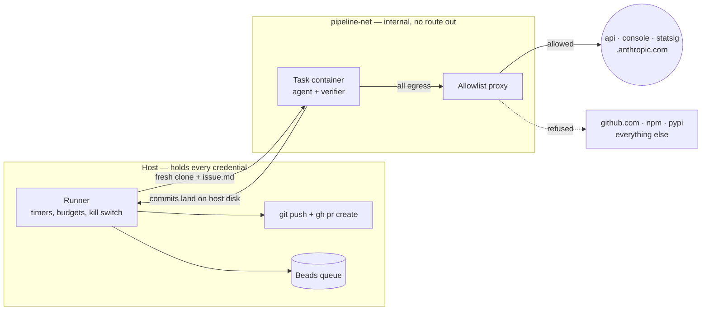

# How the pipeline works — diagrams

Visual companion to `DESIGN.md`. The doc is authoritative; these are views of it.

## End to end

Planning is interactive, implementation is autonomous, review is interactive. The
Beads queue is the join between them.

## Inside one task container

The sequence is scaffolding, not an LLM decision. The verifier is the only authority;
the agent never judges its own work.

## Where the walls are

The container holds exactly one credential and cannot reach a git host. Everything
durable — the queue, the credentials, the push — lives on the host.

## What each outcome does

| Outcome | Exit | Report status | Beads | Branch pushed | PR |
|---|---|---|---|---|---|
| Acceptance pass, regressions pass or absent | 0 | done | closed | yes | yes |
| Acceptance pass, regressions fail | 0 | partial | closed | yes | yes, flagged |
| Bailed after 3 attempts | 10 | stuck | blocked | yes, WIP | no |
| Frozen tests modified | 11 | tampered | blocked | yes, WIP | no |
| Usage limit hit | 20 | paused | stays in progress | not yet | not yet |
| Internal error | 30 | failed | blocked | if commits exist | no |
| Wall-clock kill | — | failed | blocked | if commits exist | no |

`blocked` is what takes failed work out of the ready queue: it needs a human decision
in review, so the loop can never re-pick it.
