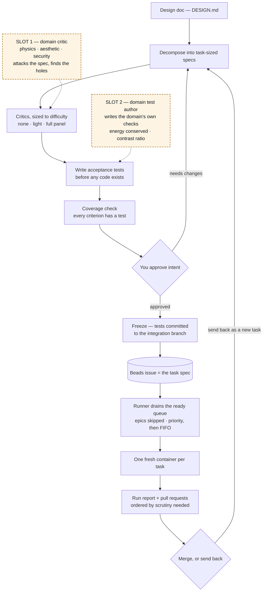
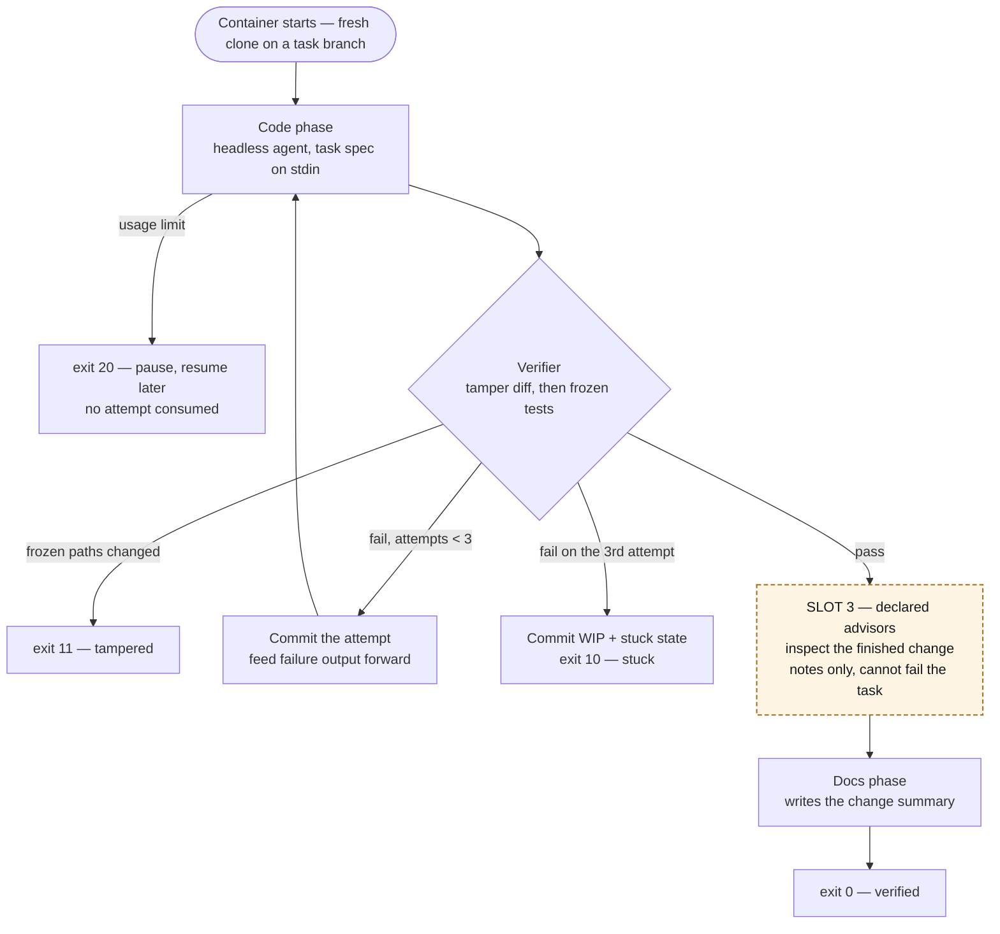
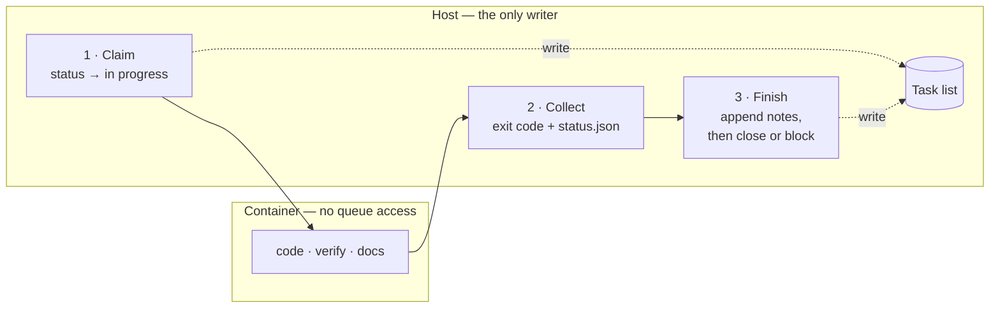
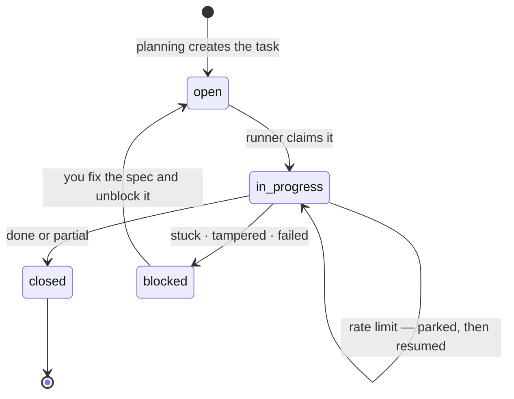
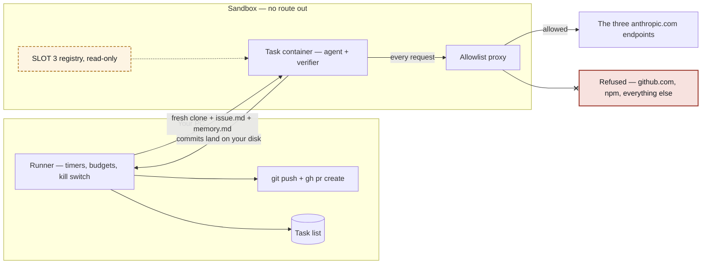

# How the pipeline works — diagrams

Visual companion to `DESIGN.md`. The doc is authoritative; these are views of it.

**Dashed amber nodes are the domain-specialist slots from §3.5.** Two of them work today
with no code (they are planning-session moves); the third needs a build. Nothing dashed
is a gate — a specialist can never fail a task.

## End to end

Planning is interactive, implementation is autonomous, review is interactive. The
Beads queue is the join between them.

Slots 1 and 2 need **no pipeline code**: they are prompts you run during a planning
session, before anything is frozen. Slot 2 is the higher-leverage of the two — a domain
check that becomes a frozen test steers the retry loop on every attempt, whereas a
review only complains once.

## Inside one task container

The sequence is scaffolding, not an LLM decision. The verifier is the only authority;
the agent never judges its own work.

Slot 3 is the one that needs building, and the sockets are already in place: the
`advisories` array exists in `status.schema.json` (typed, and documented as evidence
that can never change the exit code), advisor definitions would ride in the existing
read-only `/pipeline` mount, and `pipeline.config.json` already is the per-project
selection file. What is missing is the loop itself plus rendering in the report and PR.

**Why it sits after the verifier, not before:** an LLM judge cannot be frozen, so making
one a gate would void the three-attempt cap and produce unactionable 2 AM failures. By
the time an advisor runs, the task has already passed or failed on deterministic
grounds; the advisor only annotates.

## How a task moves through the queue

Nothing is ever deleted. A task is claimed, then closed or blocked, and every run
appends to its notes — so a stuck task arrives in review carrying its own history.

**The host is the only writer.** The container has no queue access at all: it reports
outcomes purely through its exit code and `status.json`. If the container wrote to the
queue, those writes would land on a task branch that might never merge, and the work
queue would fork along with the code.

The claim in step 1 is what stops a task being picked twice, and it is why a crashed run
leaves issues stranded `in progress` — the next run's preflight sweeps those back to
`open`.

Every arrow into the task list is a bounded, synchronous `bd` call — `bdTimeoutMs` in the
run config, default 60s, applied by `runner/bd.js` to every spawn it makes (change-log row
`repo-sls`). Step 3 is the reason: it runs *after* the container exits, so a `bd` that hangs
there would leave finished work claimed and its outcome unwritten, with no timer anywhere to
end the wait. A call that exceeds the bound is killed and reported as an ordinary failure,
which the steps above already know how to handle.

`blocked` is doing quiet but critical work: it removes failed work from the ready queue.
Without it a task that cannot pass would be picked up again on every run, forever.

An **epic** never enters this diagram at all. `bd ready` returns it alongside its children
and never closes it when they close, so the runner filters ready entries typed `epic` out
before the loop and names them in its queue-summary line — skipped, but never silently
(§3.1, §4.12).

## Where the walls are

The container holds exactly one credential and cannot reach a git host. Everything
durable — the queue, the credentials, the push — lives on the host.

Arrow styles carry meaning: a solid arrow is an allowed path, **an ✕ arrowhead is a
refusal**, and a dotted arrow is a permitted but read-only path. (These were previously
both dotted, which made a wall look like a doorway.)

The sandbox is **per project**. The network and the proxy take their names from the run
config — derived from the project segment of `run.config.<project>.json` when it names
neither — so two runner processes against two projects draw two copies of this diagram
side by side, and neither one's `up` or `down` touches the other's plumbing (change-log
row `repo-jur`). The proxy *image* is shared; only the running container and the network
are per project.

A specialist that needs a different model or a different tool changes nothing structural:
the coding agent is already swappable through `agentCommand` → `PIPELINE_AGENT_CMD`, and
the contract is only "a shell command that reads a prompt on stdin and edits files." A
non-Anthropic tool would additionally need its domain added to the allowlist — the one
place the closed-network policy would have to be revisited deliberately.

## What each outcome does

| Outcome | Exit | Report status | Beads | Branch pushed | PR |
|---|---|---|---|---|---|
| Acceptance pass, regressions pass or absent | 0 | done | closed | yes | yes |
| Acceptance pass, regressions fail | 0 | partial | closed | yes | yes, flagged |
| Bailed after 3 attempts | 10 | stuck | blocked | yes, WIP | no |
| Frozen tests modified | 11 | tampered | blocked | yes, WIP | no |
| Usage limit hit | 20 | paused | stays in progress | not yet | not yet |
| Internal error | 30 | failed | blocked | if commits exist | no |
| Wall-clock kill | — | failed | blocked | if commits exist | no |

`blocked` is what takes failed work out of the ready queue: it needs a human decision
in review, so the loop can never re-pick it. **No advisor verdict appears in this table** —
that is the point. Advisory notes ride along in the PR body and the run report as
evidence for you, and change none of these outcomes.
